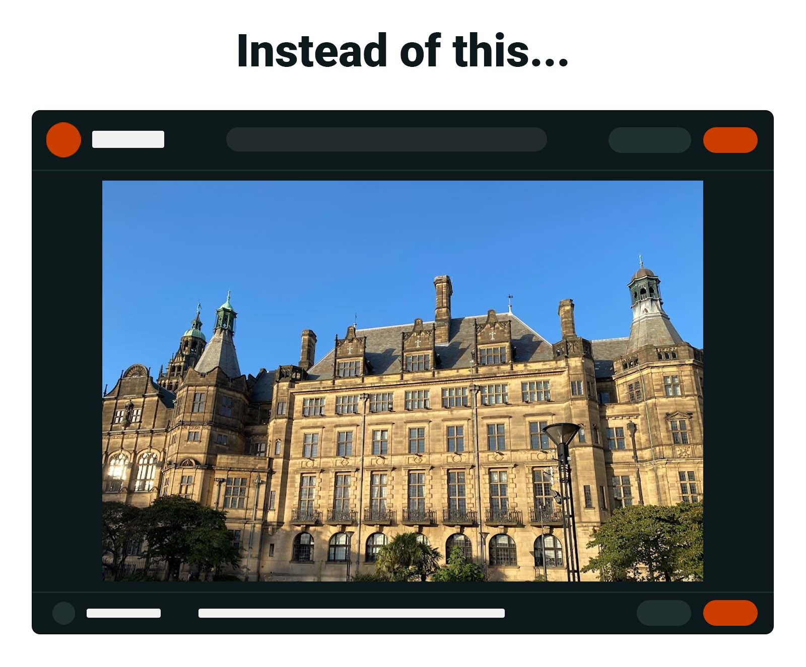

# Open Reddit images directly

Lightweight browser extension that forces images on i.redd.it and preview.redd.it to open directly in the browser, rather than being embedded in a splash page.

 

## Usage on Firefox

1. Install the addon from https://addons.mozilla.org/en-US/firefox/addon/direct-images-on-i-redd-it/
2. In Firefox:
	1. Open "Add-ons and themes"
	2. Click on the addon
	3. Go to the "Permissions" tab
	4. Enable the optional permissions

## Usage on Chrome

The extension is not currently available on the Chrome Web Store. To install it manually:

1. Download and extract the [latest version](https://github.com/Dragory/open-reddit-images-directly-webextension/releases)
2. In Chrome:
	1. Go to "Extensions" -> "Manage Extensions"
	2. Enable "Developer mode" at top right
	3. Click "Load unpacked" at top left
	4. Select the folder where you extracted the files

## Usage on Edge

The extension is not currently available on the Microsoft Edge Add-ons website. To install it manually:

1. Download and extract the [latest version](https://github.com/Dragory/open-reddit-images-directly-webextension/releases)
2. In Edge:
	1. Go to "Extensions" -> "Manage extensions"
	2. Enable "Developer mode" at bottom left
	3. Click "Load unpacked" at top right
	4. Select the folder where you extracted the files
